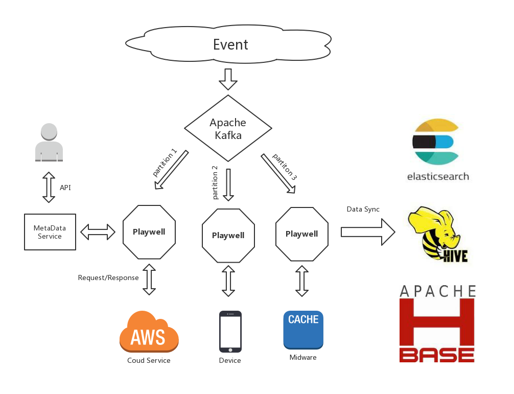
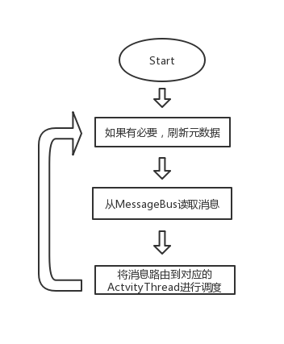

# Overview

## 概述

Playwell是一款基于事件的工作流中间件，通过对业务进行事件化建模，监听事件，并触发工作流实例。它拥有：

* 灵活的控制结构并且场景非常通用。可以在工作流中实现分支、循环、并行单元、子流程，并且拥有丰富的表达式和内置函数，满足各种业务场景。可将其应用在诸如RPA、互联网运营、DevOps、IoT等需要自动化流程编排的业务当中。
* 可轻松扩展和适配的通信渠道。无论是监听事件触发，还是调用工作流中的工作单元，Playwell整个系统都是基于异步消息进行通信的。内置的通信渠道包括HTTP协议和Apache Kafka，可以直接通过它们来传递消息，也可以对接其它协议和消息中间件。而只要交互的消息格式满足要求，您就可以将API、云服务、人机交互甚至IoT设备作为工作单元编排到自动化流程当中。Playwell的消息格式非常简单，可以与既有的各种组件轻松适配。
* 高性能。与传统的工作流框架不同，Playwell在用户空间实现了几乎无阻塞和上下文切换开销的轻量级调度，并且默认使用LSM存储引擎对状态进行持久化存储，单个节点就可以容纳上千万工作流实例，每秒可调度上万次。这些性能上的提升，使得像自动化大规模互联网运营以及需要管理众多设备的IoT等业务场景得以可能。
* 分布式扩展。支持有状态和无状态两种分布式。有状态分布式基于虚拟slots进行分布式扩展，可根据业务规模，灵活添加或者移除工作节点。无状态分布式可以将状态托管到第三方中间件，比如Redis集群，复用之前的运维经验。
* 数据安全。所有工作流状态默认持久化存储，另外提供了快照、增量备份、Replication三种方式来确保数据安全。

## 更新、问题反馈和商务合作

项目会以固定的时间进行更新，通常是每周一次发布新版本，并会公布下个版本的发布内容。

由于本项目目前处于初始阶段，非常需要有需求的公司一起来完善质量和生态。

问题反馈可以通过邮件或者提交issue，但目前只针对深度合作的企业提供实时的问题解答。

商务合作：[playwell@rpa-cn.com](http://playwell@rpa-cn.com)

技术问题反馈：chihongze@gmail.com

## 场景举例

互联网自动化运营，是Playwell可以产生价值的应用场景之一，我们先来以此场景举例。

在电商的运营当中，经常有这样一类促销活动：

> 假设用户看了某件商品超过N次，但是一直没有购买，这时给他发送一张优惠券，让他下定最后购买的决心。然后需要跟踪该优惠券的使用情况，如果优惠券没有使用，需要用推送提醒用户优惠券的到期时间。

在过去，完成这个需求，我们需要在数据库中记录用户访问商品页面的次数，然后当次数达到了阈值，调用相关服务发送优惠券，接下来可能还需要再起个定时任务，扫描优惠券的到期时间，调用推送服务加以提醒。

相信这样的需求大家都做了很多。而逐渐就会发现一些问题：

* 开发效率低。要写SQL，写程序，创建数据库表或者修改字段来记录之前没有存储的一些状态。如果涉及的数据量比较大，单个进程或单台机器无法处理，那可能会更麻烦。
* 修改不方便。比如要加入推送文案的AB测试，对比每种文案的转化效果，就需要改动程序或者额外再加入数据表来记录每种测试方案的转化结果。
* 数据需求不一致。运营关注的往往是多维度的变化趋势，比如早上起床和晚上临睡前发消息转化率会有何不同。而开发人员在数据库中记录的只是最终状态。当运营需要相关数据进行深入分析的时候，彼此就会比较尴尬。
* 运维成本高。如果缺乏相关运维规范和基础设施，会造成crontab任务泛滥和各种运营活动进程泛滥，时间长了会出现隐患。
* 体力活。在互联网公司，这种需求很多，并且会越来越多，虽说是精细化运营，但对技术来说都是无聊的体力工作，做多了非常不利于身心健康。这是最大的问题。

而如果我们使用Playwell完成这个需求，就不需要使用Java、PHP、Python这些语言来写程序，也不需要在数据库中记录状态，我们只需要对应用进行事件埋点，然后按照需求描述把相关组件编排到工作流中即可。如果再简单配置一下，就可以实时的将活动状态同步到诸如Elasticsearch、Hive等数据仓库，供数据分析人员进行深入分析以及开发人员进行链路跟踪。

Playwell的自动化流程都是由事件触发的。在Playwell中，事件是由三部分构成：类型、属性、时间。只要在业务逻辑执行时将这些事件通过HTTP协议或者Apache Kafka这样的消息中间件传递给Playwell，之后我们就可以基于这些事件来触发工作流实例。比如，这是一个查看商品详情的事件，每次用户在查看商品详情的时候，会将一个类似结构的消息传递给Playwell：

```json
{
  "type": "user_behavior",
  "attr": {
    "behavior": "查看商品详情",
    "user_id": 10010,
    "goods_id": 2002,
    "goods_title": "Sony PS5"
  },
  "timestamp": 1561269531131
}
```

Playwell中的工作流是基于YAML和表达式来进行定义的，接下来，我们一起实现上文描述的需求：

```yaml
activity:
  name: coupon
  domain_id_strategy: user_id_goods_id
  config:
    max_visit_count: 5
  
  # 触发器，定义活动的触发规则
  trigger:
    type: event
    args:
      # 表达式中的eventTypeIs和eventAttr都是Playwell的内置函数
      # 前者用于获取当前触发事件类型，后者用于获取事件属性
      condition: eventTypeIs("user_behavior") AND eventAttr("behavior") == "查看商品详情"
    context_vars:  # 将事件中的属性写入到上下文变量
      user_id: eventAttr("user_id")
      goods_id: eventAttr("goods_id")
      goods_title: eventAttr("goods_title")
      visit_count: 1
  
  actions:
    # 等待事件，如果查看商品详情，则增加计数
    # 如果购买了商品，则直接结束流程
    # 如果超过10天没有收到任何事件，则结束该流程
    - name: waiting_visit_event
      type: receive
      args:
        - when: eventAttr("behavior") == "查看商品详情"
          context_vars:
            # var函数用于获取上下文变量，这里是将visit_count递增后重新赋值
            visit_count: var("visit_count") + 1
          then: call("deciding")
        - when: eventAttr("behavior") == "购买商品"
          then: finish()
        - after: days(10)
          then: finish()

    # 判断访问次数，如果超过5次，调用优惠券单元
    - name: deciding
      type: case
      args:
        # config函数可以获取配置中的常量值
        - when: var("visit_count") >= config("max_visit_count")
          then: call("coupon")
        - default: call("waiting_visit_event")

    # 优惠券单元，调用优惠券微服务
    - name: coupon
      type: coupon
      args:
        request:
          user_id: var("user_id")
          goods_id: var("goods_id")
        timeout: minutes(1)  # 超时时间，如果1分钟优惠券服务没响应，则返回一个超时结果
      ctrl:
        - when: resultOk()  # 如果服务返回成功
          context_vars:
            coupon_expire_time: resultVar("expire_time")
          then: call("waiting_buy")
        - default: failBecause("coupon_service_error")  # 服务返回其它状态，失败退出

    # 等待购买，如果用户两天后依旧没有购买，
    # 那么提醒他优惠券过期
    - name: waiting_buy
      type: receive
      args:
        - when: eventAttr("behavior") == "购买商品"
          context_vars:
            bought: true
          then: finish()
        - after: days(2)
          then: var("notified", false) ? finish() : call("notify")
    
    # 发送优惠券过期时间提醒推送
    - name: notify
      type: push
      args:
        request:
          user_id: var("user_id")
          content: str("您有一张优惠券，可以用来购买心心念念的%s，使用期限截止到%s", var("goods_title"), var("coupon_expire_time"))
      await: false
      ctrl:
        - default: call("waiting_buy")
          context_vars:
            notified: true
```

如果我们的系统部署配置完好，并且注册了相关服务以及拥有相关事件埋点，那么只要将上述定义通过客户端或API传递给Playwell，并创建一个Activity，其它的什么都不用做，我们的需求就完成了。接下来简单解释下定义中各个部分的含义。

### name

工作流定义名称，在系统中具有唯一性，可用来具体引用某个工作流定义。

### domain_id_strategy

系统中会有大量的事件，而每个工作流实例只关心自己感兴趣的事件，通过`domain_id_strategy`可以指定一个事件路由策略，只有满足策略的事件才会被传递给工作流。

这里指定了工作流的消息路由策略为`user_id_goods_id`，该策略会从事件属性中提取`user_id`和`goods_id`，将其作为工作流实例的Domain ID，Domain ID用于标识一个工作流实例，具有相同`user_id`和`goods_id`的消息会被路由到同一个工作流实例。比如小明看了XBox，那么小明在XBox这件商品下所发生的所有事件都会路由到`小明_XBox`这个工作流实例；而如果小明又看了PS4，那么小明在PS4这件商品下所发生的所有事件都会路由到`小明_PS4`这个工作流实例。小明在XBox下的事件只能路由到`小明_XBox`实例，而不会路由到`小明_PS4`实例。

以下事件经过`user_id_goods_id`的DomainID策略时都会被路由到`小明_PS4`：

```json
{
  "type": "user_behavior",
  "attr": {
    "behavior": "查看商品详情",
    "user_id": "小明",
    "goods_id": "PS4"
  },
  "timestamp": 1561269531131
}

{
  "type": "user_behavior",
  "attr": {
    "behavior": "购买商品",
    "user_id": "小明",
    "goods_id": "PS4"
  },
  "timestamp": 1561269531131
}
```

以下事件经过`user_id_goods_id`的DomainID策略时都会被路由到`小明_XBox`:

```json
{
  "type": "user_behavior",
  "attr": {
    "behavior": "查看商品详情",
    "user_id": "小明",
    "goods_id": "XBox"
  },
  "timestamp": 1561269531131
}

{
  "type": "user_behavior",
  "attr": {
    "behavior": "购买商品",
    "user_id": "小明",
    "goods_id": "XBox"
  },
  "timestamp": 1561269531131
}
```

### config

配置常量。可以在工作流定义中去指定一些常量，也可以在创建Activity的时候去覆盖它们。这些配置常量可以在流程中通过`config("常量名称")`内置函数进行访问。有些常量是属于系统内置的，比如当我们添加一个`$thread_log: "all"`的配置时，就会打印出调度的详情和上下文以及服务返回结果，方便测试和Debug。

### 程序、进程、线程 和 ActivityDefinition、Activity、ActivityThread

我们知道，在操作系统中，有`程序` -> `进程` -> `线程`的组织层次。程序就是一份编译后的代码，位于文件系统的某个安装目录当中；程序要执行起来，就需要启动进程，程序往往会在代码中有一些默认配置，在启动进程时，可以使用额外的配置文件和环境变量来覆盖这些配置，这样，一份程序就可以启动多个进程，每个进程拥有不同的配置，比如数据目录不同或者提供服务的端口号不同；而进程中又可能需要并发处理不同的逻辑或者请求，这时就需要在进程当中创建多个线程。

Playwell的抽象也拥有类似的层次，即`ActivityDefinition`  -> ` Activity`  ->  `ActivityThread`。

ActivityDefinition就是我们上述用YAML和表达式编写的工作流定义，相当于程序，其中的config，就相当于在代码中声明的默认配置。

而Activity就相当于是进程，一个ActivityDefinition可以启动多个Activity，并且Activity可以有自己独立的config来覆盖ActivityDefinition中的默认配置。比如我们基于同一个ActivityDefinition创建了多个Activity，有的Activity可以把`$thread_log`设置为"all"，在日志中输出调度详情，有的可以不设置，就不会输出。

每当事件满足了trigger定义的条件，在Activity中就会启动一个ActivityThread（工作流实例）来执行工作，在上面的例子中，小明每查看了一个新的商品，就会启动一个对应的ActivityThread。ActivityThread依据从`domain_id_strategy`提取出的Domain ID进行标识，在同一个Activity当中，每个ActivityThread的Domain ID都是唯一的，比如在Actvity 1中只能拥有一个`小明_XBox`的ActivityThread，小明在XBox这件商品下发生的所有事件都会路由到该ActivityThread。而如果我们使用同样的ActivityDefinition创建一个Activity 2，那么1和2下可以各自拥有一个`小明_XBox`的ActivityThread。

Activity之间是彼此隔离的，ActivityThread之间也是彼此隔离的，但ActivityThread之间可以通过消息进行通信，用以完成一些复杂的协作，比如父子流程、栅栏等等，而反应到业务上，就可以实现拼团之类的活动，后面我们会详细加以介绍。

与操作系统的底层的线程不同，单个节点有时就可以容纳上千万个ActivityThread。

### trigger

触发器。定义ActivityThread的触发规则，由三部分构成：

* `type`：触发器类型，当前版本只有一种类型，即event，事件类型
* `args`：触发器参数，事件类型触发器只有一个参数 - condition，通过表达式来描述触发条件
* `context_vars`: 初始化上下文变量。上下文变量即在整个ActivityThread中可以共享的变量，可通过`var("变量名称")`来进行访问。可以将触发事件属性的值作为上下文变量的初始值。

### actions

Actions编排了一系列的活动单元。流程触发后，Playwell会从第一个单元开始执行，然后根据执行结果和上下文变量，跳转到不同的单元、结束执行或失败退出。可以把它理解为一个有限状态机。

这些活动单元有Playwell内置的，比如上文中`type`为`case`的单元，就是一个条件分支的控制单元，它就像我们在很多语言中常见的那种`if (condition) ... else if (condition) ... else ...`结构，判断当前上下文变量的值是否满足条件，然后决定下一步的走向。

而有些活动单元是用户自己构建的服务，比如优惠券`coupon`单元和推送`push`单元，Playwell有一套服务管理机制，用户只需要注册一下自己服务的信息，就能够在工作流中以工作单元的方式来引用它们。执行到这些单元的时候，Playwell会依据上下文来构建请求参数，并等待服务的响应。

在诸如C#、Java这样的编程语言当中，像if、switch、while、for，实现流程控制的都是语言的关键字。Playwell中虽然也有这样的流程控制结构，但却没有什么"关键字"单元，它们都是普通的工作单元，背后是同一套抽象体系。用户可以基于Playwell现有的抽象基础，构建自己喜欢的控制结构。

下面我们来介绍一下Action定义的各个部分。

#### name [必须]

活动单元名称，在ActivityDefinition中唯一，用来引用具体的Action。

#### type [必须]

活动单元类型，即指明该活动单元所要完成的任务，比如`case`类型的单元就是条件分支，`receive`类型的单元会等待指定的事件发生直到超时。

#### args [必须]

活动单元参数。每个活动单元所接受的参数是由活动单元的type决定的，比如`case`类型的单元接受的是一个列表，列表中包含了一系列条件。

这些参数在声明的时候都只接受表达式，只有当执行到该工作单元的时候，才会去将这些表达式动态计算为具体的值。当然，这也意味着有些问题只有在执行的时候才会暴露出来，所以，使用Playwell开发也要如同用其它语言编写程序一样去仔细测试，并注意各种逻辑条件下的覆盖。

#### ctrl 

ctrl编排了一系列的控制条件，用于在一个Action执行结束后，决策ActivityThread下一步的执行。

像`case`和`receive`这种单元，它们没有返回结果，在执行的时候就决定了接下来流程的走向。而像一些服务类型的单元，比如优惠券`coupon`，我们需要知道远程服务执行成功、失败还是超时，才能决定下一步该做什么，并且可能还需要将它们的一些执行结果纳入到上下文变量中供后续活动单元使用。ctrl属性就是编排了一系列的控制条件来根据结果决定下一步工作流的走向，它的结构跟`case`单元的参数一致：

```yaml
- when: 条件表达式
  context_vars:
    变量A: 变量表达式
    变量B: 变量表达式
  then: 流程控制函数
- when: 条件表达式
  then: 流程控制函数
- default: 流程控制函数
  context_vars:
    变量C: 变量表达式
```

系统会按照声明顺序匹配`when`所指定的条件表达式，如果满足匹配条件，会将`context_vars`中的上下文变量重新计算赋值，然后执行`then`所指定的控制函数。如果所有的`when`都不匹配，就会执行`default`所指定的流程控制函数。

流程控制函数决定了ActivityThread下一步的走向，常用的流程控制函数：

* `call("工作单元名称")` 跳转到指定的工作单元执行。
* `finish()` 表示ActivityThread顺利结束执行，可以把它理解为系统调用`exit(0)`
* `failBecause("错误代码")` 发生错误退出执行，可以把它理解为系统调用`exit(error_code)`
* `repair("错误代码")` 向监控服务发出通知，保留上下文，并等待修复指令。`repair`是playwell一种重要的错误处理机制，后续我们会在相关章节进行详细介绍。
* `retry(retryCount, retryFailureAction)` 对当前工作单元进行重试，接受两个参数，一个是重试次数，一个是重试之后的行为。比如`retry(3, call("fail_handler"))`就会在重试3次失败之后跳转到`fail_handler`单元执行。

#### await [可选]

正如上文所述，像`coupon`这样的工作单元是以服务的形式来实现的，Playwell完全通过异步消息的方式来和这些服务进行通信。当流程运行到`coupon`单元时，Playwell会向`coupon`服务发送一个请求消息，然后ActivityThread会进入waiting状态，不再被调度执行，直到coupon完成了请求，再以消息的形式向Playwell返回结果，这时ActivityThread才会再次被调度。依据返回结果，执行ctrl里面的分支，决定下一步走向。

如果在定义中不设置await，await默认为true。当await为true的时候，只有得到结果消息，ActivityThread才会继续执行，而有些时候我们并不关心执行结果，只需要请求一下相关服务，然后继续往下执行。此时就可以把await属性设置为false，比如上文中的`push`单元，ActivityThread会向`push`服务发送一条请求消息，接下来不会等待`push`返回结果消息，就直接跳转到`waiting_buy`单元。

对服务的请求消息中也会带有`await`属性，如果服务发现`await`属性为false，那么就可以选择不再给playwell传递返回结果，以避免不必要的传输开销。

### 上下文变量

在上述例子中，我们使用了很多上下文变量，比如`user_id`、`goods_id`、`visit_count`等等，上下文变量的作用域是当前的ActivityThread实例，上下文变量有两大重要作用：

- 一是在action之间传递数据，比如一个action的结果可以通过上下文变量作为另一个action的参数。
- 二是表示当前业务所处的状态，决定流程下一步的走向或者纯粹表示状态供数据分析使用。

Playwell在底层默认使用RocksDB来持久化存储ActivityThread相关元信息以及上下文变量，如果进程重启，这些状态是不会丢失的。

上下文变量不适合存储尺寸比较大的值，只适合存储一些基本类型，比如数字、较短的字符串、布尔、元素较少的列表和字典。如果业务涉及到尺寸较大的值，那么可以使用诸如数据库、文件甚至HDFS、S3等外部存储，在上下文变量中只保留一个像是路径之类的引用，然后异步调用专门的服务去处理这些值。至于变量的具体长度上限需要参照使用的存储引擎，如果使用默认的RocksDB引擎，那么一个ActivityThread所有变量的总长度应该尽可能不超过4KB，这是RocksDB默认的读取页大小，当然，也可以根据业务场景来调整该选项。

在设计对并发和性能有要求的流程时，需要尽量避免过长的上下文变量。一是会对调度系统的存储造成压力；另外，读取存储这些过长的变量值也会对调度进程造成一定的阻塞。我们希望对ActivityThread的调度是几乎没有阻塞的，可以非常快的完成。

### 整体流程

明确了上述定义中的各个组成部分，我们就可以理解整体的业务逻辑。假设有一个用户ID是小明，一件商品ID是PS4。

小明第一次看PS4，一个"查看商品详情"的事件会通过HTTP或者Apache Kafka传递到Playwell，该事件满足trigger的触发条件，于是就产生了一个DomainID为`小明_PS4`的ActivityThread，同时会将事件中的`user_id`、`goods_id`等相关属性添加到ActivityThread上下文变量。

新的ActivityThread创建后，调度器会首先从actions的第一个单元`waiting_visit_event`开始执行。该单元会等待下一次的访问事件，当小明第二次看了PS4，事件就会被路由到该ActivityThread，从而触发该单元的执行：将`visit_count`的值+1，然后调用`deciding`单元来决策是否达到了指定的查看次数阈值。

当达到了指定的访问次数，`deciding`单元就会跳转到`coupon`单元发送优惠券，如果没有达到，那么会重新跳转到`waiting_visit_event`单元继续进行等待。

如果小明访问了一次后十天再也没有什么操作，那么会触发`waiting_visit_event`单元中`after…then`所指定的操作，结束整个ActivityThread，并释放相关资源。当小明下次再访问，就会触发一个新的ActivityThread，`visit_count`也会从头开始计数。

receive单元中，after条件是可选的，如果不指定，那么这个ActivityThread可能就会一直常驻系统，等待事件发生。尽管在Playwell中每个ActivityThread所占用的资源非常少，等待操作也不会阻塞任何操作系统底层的线程或者影响其它的ActivityThread调度，但当多数情况下等待条件不能满足，比如大多数用户只是看一次商品，不会再继续看，就会造成大量的ActivityThread"泄露"，浪费存储空间或者对调度产生不必要的压力，因此，为等待操作指定一个after总是一个好的实践。

`coupon`单元会依据服务注册信息来发送请求消息，并在计时器注册一个1分钟后的时钟消息。这些完成之后，调度器就不会再对该ActivityThread做什么，转而去处理其它的ActivityThread，只有等下一条属于该ActivityThread的消息到来：

* 如果coupon的处理结果消息先到
  * 结果OK，则将返回的优惠券信息加入到上下文中，并进入`waiting_buy`单元来等待购买转化事件
* 如果时钟事件先到，那么算是服务超时

如果coupon返回了错误的结果或者发生了超时，那么都会调用`failBecause`控制函数，ActivityThread会因为失败而结束，相关资源同样会被回收。然后接下来继续等待发送优惠券后，用户是否转化的事件，逻辑基本同上。

### 消息、事件、命令

在这里，我们有必要对相关名词进行统一。

事件，通常用于描述当下已经发生的事情，比如用户的操作行为。

命令，通常用于改变系统的当前状态，比如我们可以向ActivityThread发送一个kill，让系统将其销毁，这就是命令。

命令和事件都是属于消息，在Playwell中，它们都是通过MessageBus传递。但我们在文档中会用事件来描述诸如用户行为的消息，用命令来描述诸如系统控制类型的消息。

### 消息处理

`domain_id_strategy`会确保拥有相同`user_id`和`goods_id`的消息被路由到具有相同DomainID的ActivityThread进行处理。并且ActivityThread总是按照顺序来依次处理它们。每个ActivityThread就像是拥有一个独立的消息队列，消息会先投递到队列中，然后一次只能处理其中的一个消息。

假设小明以极快的速度连续查看了两次PS4，这时候队列中就会有两个事件，`waiting_visit_event`会先选择第一个事件，然后调用`deciding`，如果不满足条件，会重新返回`waiting_visit_event`，这时会取出第二个事件进行匹配；而如果第一个事件已经满足了`deciding`，那么会执行到`coupon`，`coupon`在发出请求消息后会检查ActivityThread的消息队列中残存的消息，此时第二个事件就会被取出，`coupon`期待的是服务响应消息或者是自己发出的时钟消息，这时候多余的用户事件就会被丢弃。

如果你对Erlang或Akka有所了解，会发现这种消息处理机制跟这些系统中"邮箱"的概念比较相似。

这种工作方式简而言之，就是系统中存在一系列的实体，这些实体并不像传统的结构体或对象，而是像独立的线程一样可以执行，需要通过某种方式来对它们进行定位，比如Playwell中是通过(ActivityID, DomainID)进行定位。每个实体有自己的内部状态，其它实体是无法修改甚至查看这些状态的，实体之间只能通过发送消息进行通信，每个实体根据收到的消息变更自己的内部状态，实体拥有独立的"邮箱"，收到的消息会存放在邮箱当中，实体会按接收顺序或者用户自定义的优先级顺序来处理邮箱中的消息。通过这种方式来设计程序，往往就会使并发更加容易，不必或很少需要处理复杂的全局状态，也降低了组件之间的耦合，还可以在用户态中构建起一套更加轻量级的调度策略，像无论Erlang还是Akka还是Playwell，都是可以允许系统中存在大量这种可并发执行的实体。

与Erlang的不同之处：如果你了解Erlang的receive … after语句，应该会知道对于不满足匹配条件的消息，Erlang会将其暂存在邮箱中，供下次匹配。因此，在编写Erlang程序的时候，我们必须认真思考消息匹配模式，以避免在邮箱中堆积过多无法匹配的消息。Playwell在这部分的设计与Erlang不同，如果消息不是当前单元所需要的，会被直接忽略掉。

## 宏观架构



上图为Playwell默认的"有状态"分布式架构拓扑。

* 事件经过一定的路由规则，写入对应的Kafka Partition，路由规则会确保同一个Domain ID的事件写入到同一个Partition中。
* 每个Playwell处理节点各自订阅一个Kafka Partition，由于前面的路由规则，同一个ActivityThread所有消息都会在同一个处理节点中进行处理，其所有状态会存储在该节点，除非发生迁移。
* 像ActivityDefinition、各种服务等相关元数据都是由各种MetaDataService进行存储，这是一个抽象的组件，默认是基于MySQL实现。通常，在Playwell节点启动的时候，它们会去MetaDataService存储中读取所有的元数据，然后缓存在自己本地，这使得在以后的运行中，获取元数据的消耗基本忽略不计，然后在每次事件循环之前会去检查元数据有无更新，如果有，会刷新自己本地的缓存。
* Playwell会通过异步消息，来调度各种外围组件的执行，包括云服务、移动设备、中间件等等。这些请求和响应消息在分布式环境中通常也会通过Apache Kafka来传递，当前版本的Playwell没有实现自己的消息通信渠道。
* Playwell可以在每次ActivityThread发生了新的状态变化时把当前状态和上下文变量同步到诸如Elasticsearch、Hive、HBase等各种数据存储中。这样做有两个目的：一个是业务角度，可以获取非常详尽的状态趋势用于做数据分析；再一个是从技术角度，相当于同时记录了所有的链路，方便排查问题，只需要搜索一下相关Activity的某个Domain ID，就可以准确得知某个用户的某项业务是在哪里失败的。

上述的分布式是"有状态"的分布式，Playwell节点除了执行工作流调度，也通过RocksDB等嵌入式存储引擎记录了每个ActivityThread当前的状态(比如执行到了哪个Action)和上下文变量。Playwell以虚拟的Slots方式来实现这种有状态的分布式，比如，你可以为将整个集群设置为总共拥有1000个slots，有三台机器：ABC，每台机器掌管不同的slots，比如A掌管300个，B掌管500个，C掌管200个，这样A就会处理集群30%的事件，B处理50%，而C处理20%，如果要增加节点，可以从ABC各自迁移一部分slots到新节点。如果要将其中某个节点下线，比如将B下线，那么可以将B中的slots分摊给A和C两个节点，B就不再负责任何slots，然后就可以安全下线。

另外，Playwell也支持"无状态"的分布式，Playwell自身不存储任何数据，单纯只是调度，所有状态可以存储在第三方的服务中，比如Redis、MySQL或者HBase。这样分布式运维只需要管理好这些第三方存储集群就好了。最重要的是，如果用户已经对些存储积累了大量的运维经验和工具，那么就可以复用这些经验和工具。

Playwell既支持分布式，也支持单机，甚至也可以集成到移动设备当中。因为其所有组件都是基于抽象接口构建的，所以只要拼装不同的实现，就可以在不同的环境和场景之下运行。比如在服务端运行，可以使用基于MySQL实现的组件存储元数据，而在移动设备运行就可以使用基于SQLite的存储组件。不存在哪个组件必须依赖哪个特定实现的情况。

## Event Loop



每个Playwell进程，本质上是一个不断接收并处理消息的event loop，以下是每次循环的基本逻辑：

* S1. 通过诸如比较版本号的方式，检查元数据(ActivityDefinition、Activity、服务注册和消息通道)是否有更新，如果有，则刷新本地缓存。
* S2. 从MessageBus获取指定数目的消息。MessageBus是一个抽象的组件，实现可以是各种各样，比如HTTP、Apache Kafka、RabbitMQ等等。接收到的消息类型也是多样的，包括用户行为事件、服务响应消息、时钟消息以及系统控制命令等等。
* S3. 对这些消息进行分类，并路由到对应的ActivityThread进行调度。ActivityThread收到自己期望的事件会被唤醒，然后执行处理。这些ActivityThread的调度会被统一安排在一个线程池中被并行调度。另外，消息类型的不同，其处理的优先级也不同，会先保证系统控制命令(比如针对某个ActivityThread的kill操作和pause操作)得到处理，然后是时间和服务响应，最后是普通事件(比如用户行为事件)。在每个类型下，会保证每个ActivityThread所处理的消息顺序是有序的。
* S4. 返回S1，开始下一次的循环。

上述是一个整体的大循环，而每个ActivityThread本质上是一系列小的事件循环，但其逻辑要比大循环复杂的多。你也可以将其理解为一个大的事件消费者，在获取事件后，再将事件路由给一系列小的事件消费者。

## 目录

通过以上的描述，大家应该对Playwell会有一个大概的认识。接下来，我们会依照下面的目录，详细介绍Playwell各个部分的细节。

* <a href="https://github.com/playwell-framework/playwell/blob/master/playwell-manual/UNIT_01_GettingStart.md">GettingStart</a>
* RPA场景、单元扩展和实施
* <a href="https://github.com/playwell-framework/playwell/blob/master/playwell-manual/UNIT_02_DomainID.md">Domain ID</a> 事件路由策略以及Domain ID Strategy的相关操作
* <a href="https://github.com/playwell-framework/playwell/blob/master/playwell-manual/UNIT_03_ActivityDefinition-结构类型表达式.md">ActivityDefinition</a> 结构、表达式、内置函数
* <a href="https://github.com/playwell-framework/playwell/blob/master/playwell-manual/UNIT_04_Action.md">Action</a> 同步和异步Action 内置工作单元：`case`、`foreach`、`stdout`、`compute`、`delete_var`、`sleep`、`clock`、`send`、`receive`、服务单元、`concurrent`
* <a href="https://github.com/playwell-framework/playwell/blob/master/playwell-manual/UNIT_05_ActivityDefinition的更新和其它操作.md">ActivityDefinition的更新和其它操作</a>
* <a href="https://github.com/playwell-framework/playwell/blob/master/playwell-manual/UNIT_06_Activity.md">Activity</a> 基本操作与系统配置项
* <a href="https://github.com/playwell-framework/playwell/blob/master/playwell-manual/UNIT_07_ActivityThread.md">ActivityThread</a> 生命周期 基本操作 扫描
* <a href="https://github.com/playwell-framework/playwell/blob/master/playwell-manual/UNIT_08_MessageBus.md">MessageBus</a> IO优化 基本操作 HttpMessageBus KafkaTopicMessageBus KafkaPartitionMessageBus
* <a href="https://github.com/playwell-framework/playwell/blob/master/playwell-manual/UNIT_09_Service.md">Service</a>  请求响应 用不同语言开发Service 基本操作
* 时钟 工作原理 独立时钟服务 基本操作 (文档待完善)
* 错误处理 (文档待完善)
* 数据同步 (文档待完善)
* 分布式 (文档待完善)
  * 有状态分布式
  * 无状态分布式
* 运维实践 (文档待完善)
* 业务场景模板与实例 (文档待完善)